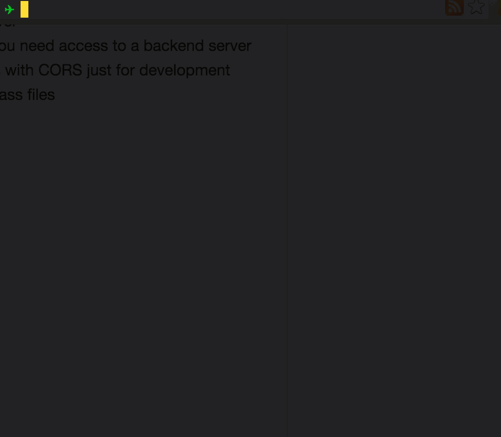

## Webpack hot generator 



Generate a webpack hot loadable es6 ready project. This structure is different from using something like webpack-dev-server, it provides:

- framework agnosticism, use react, angular, whatever you like
- es6 support via babel
- hotloading via [webpack-hot-middleware](https://www.npmjs.com/package/webpack-hot-middleware) and an express server
- support for request proxying via http-proxy, super handy if you need access to a backend server that you don't have to control of or if you don't want to mess with CORS just for development
- sass support in webpack so you can simply require in your sass files

## Directory structure

```
- src/
-- index.html
-- main.js
-- index.scss
- build/
-- ... build files here
- server.js
- package.json
- webpack.config.js
```

## Usage & Workflow

```
yo webpack-hot
npm start
# open localhost:1616 in your browser
# and start writing your app in your src/ folder
```

## Builds

Once you are ready to build your app, simply run:

```
npm run build
```

and your build will be ready in the `build` folder

## License

MIT
